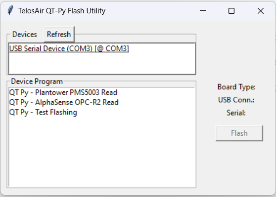

# QTPyFlashUtility

This repo contains code for flashing the QT Py SAMD21 Board with a precompiled code. 

This will serve for now as a means for SMC/SNU to flash the QT Py with code to read the PMS5003 or OPC-R2. Eventually, this will be used as a basis for a more mature program for them to use with the Mannequin project.



## To Build

### Environment Prep
Install all of the dependencies using `pip`. I will later list these, but among the ones not used in the repo is `pyinstaller`.

### Pyinstaller

First you will need to "compile" the code with Pyinstaller. From a PowerShell in the project directory, do the following command:

``` powershell
pyinstaller .\app.spec
```

This should create two folders, `build` and `dist` in the current directory. 

`dist/App/TelosAirQTPyFlashUtil.exe` is the executable that will run the program.

_Note: I have not tested Pyinstaller with Mac OS yet since it is not needed for deliverables._

### InstallForge (Windows)

You will need to install InstallForge, an app for making installers for Windows.

Follow this link to download the installer for InstallForge:

```
https://installforge.net/downloads/?i=IFSetup 
```

Use it to open the file `install_forge_project.ifp`. (Later I will explain how to do that)

Then, if you've made changes or there's an issue with it trying to look for _my_ computers files (I will check this later),
you can hit the `Remove All` button to remove all the files, then `Add Folder` to add `dist/App` as a directory.

Now, configure the build settings to save the installer somewhere tangible. To do this, click `build` on the left panel (not the top) and click the `...` button after `Setup File`. Then you can name and locate the file.

Then, hit the `build` button at the top. This will create the new installer `.exe` file.

## To Install
To install the version I have here, just run the file `TelosAirQTPyFlashUtilInstaller.exe`.

If you follow the section `To Build` above, you can run that `.exe` file as well.

## To Run
Just search for the app in Windows and run it.